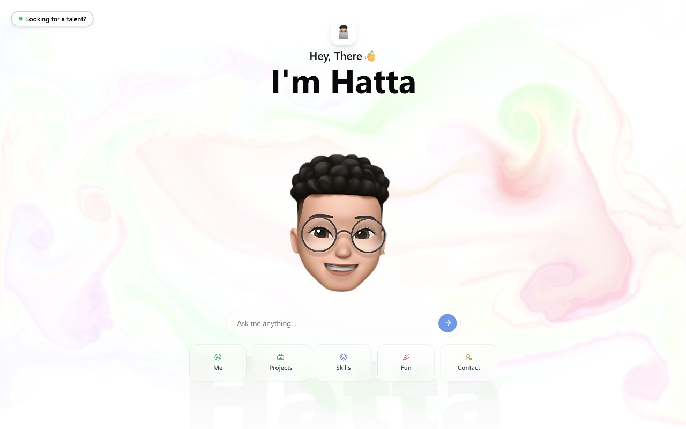

# Hatta's portfolio 🤖✨  



**Static portfolios are dead.**  
So I built [hattabd](https://hattabd.vercel.app).

Instead of making you scroll endlessly, my portfolio adapts to *you*.  
Ask a question — my AI avatar replies instantly.

## 👇 What can you ask?

- 🧠 **Tech recruiter?** Ask about my stack & results  
- 💻 **Dev?** Dive into my code & mindset  
- 🧑‍🤝‍🧑 **Friend or family?** See what I've been working on  

---

This is not a portfolio.  
It's a **conversation tailored to your curiosity**.

### Prerequisites

- **Node.js** (v18 or higher)
- **pnpm** package manager
- **OpenAI API token** (for AI chat functionality)
- **GitHub token** (for GitHub integration features)

### Setup

1. **Clone the repository**

   ```bash
   git clone <your-repo-url>
   cd portfolio
